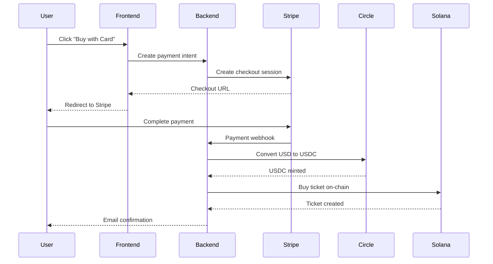

# Stripe Integration Strategy

## The Problem

Current barriers to entry:
- Users need crypto wallet
- Must have USDC
- Need to understand blockchain
- Complex onboarding process

## The Solution

Seamless fiat-to-crypto flow via Stripe:

<Steps>
  <Step title="User Selects Asset">
    Browse and choose asset to enter lottery
  </Step>
  <Step title="Click 'Buy with Card'">
    Option to pay with credit/debit card
  </Step>
  <Step title="Stripe Checkout">
    Standard Stripe payment form (familiar UX)
  </Step>
  <Step title="Auto-Conversion">
    Fiat → USDC conversion behind the scenes
  </Step>
  <Step title="Ticket Issued">
    User receives ticket, no wallet needed
  </Step>
</Steps>

## Technical Architecture

### Flow Diagram



### Components

1. **Stripe Connect**
   - Handle fiat payments
   - KYC/AML compliance
   - Payout to asset owners

2. **Circle API**
   - USD to USDC conversion
   - Stablecoin issuance
   - Treasury management

3. **Custodial Wallets**
   - Server-side wallet generation
   - Secure key management
   - User-specific addresses

4. **Smart Contract Integration**
   - Automated ticket purchase
   - On-chain verification
   - Winner notification

## Implementation Details

### Backend Changes

```typescript
// New endpoint for card payments
POST /api/tickets/buy-with-card

{
  "assetId": 123,
  "quantity": 5,
  "email": "user@example.com",
  "paymentMethodId": "pm_xxx"  // From Stripe
}
```

Response flow:
1. Create Stripe payment intent
2. Charge card via Stripe
3. Convert USD to USDC via Circle
4. Create custodial wallet for user (if first time)
5. Execute on-chain ticket purchase
6. Send confirmation email
7. Store payment record

### Database Schema

```typescript
// New Payment model
{
  userId: ObjectId,
  assetId: number,
  ticketQuantity: number,
  amountUSD: number,
  amountUSDC: number,
  stripePaymentId: string,
  circleTransferId: string,
  solanaSignature: string,
  status: 'pending' | 'completed' | 'failed',
  custodialWallet: string,  // If applicable
  createdAt: Date
}
```

### Security Considerations

<Warning>
**Custodial Risk**: Platform holds private keys for user wallets. Implement:
- Hardware security modules (HSM)
- Multi-signature requirements
- Insurance coverage
- Regular security audits
</Warning>

## Pricing Strategy

### Fee Structure

To cover additional costs:

| Payment Method | Platform Fee | Processing Fee | Total |
|----------------|--------------|----------------|-------|
| **Crypto (USDC)** | 1.5% | 0% | **1.5%** |
| **Card Payment** | 1.5% | 3.4% | **4.9%** |
| **ACH Transfer** | 1.5% | 0.8% | **2.3%** |

### Example Calculation

$100 ticket via credit card:
```
Ticket Cost:         $100.00
Processing Fee:      $3.40 (3.4%)
Platform Fee:        $1.50 (1.5%)
------------------------
Total Charged:       $104.90
User Pays:           $104.90
Asset Owner Gets:    $98.50 (from ticket pool)
```

## Compliance & Legal

### KYC Requirements

Stripe handles identity verification:
- Name and address verification
- Government ID check (for large amounts)
- Sanctions screening
- PEP (Politically Exposed Person) checks

### AML Compliance

- Transaction monitoring
- Suspicious activity reporting
- Record keeping requirements
- Jurisdiction-specific rules

### Regulations

Must comply with:
- **USA**: FinCEN, state money transmitter licenses
- **EU**: MiCA, 5AMLD
- **UK**: FCA regulations
- **Others**: Country-specific requirements

## User Experience

### For New Users

1. **No wallet needed**
   - Sign up with email
   - Use credit card
   - Receive tickets automatically

2. **Gradual crypto education**
   - Optional wallet creation
   - Learn about blockchain
   - Transition to self-custody

3. **Familiar interface**
   - Looks like any e-commerce
   - Standard payment methods
   - Email notifications

### For Existing Crypto Users

- Keep using USDC directly
- Lower fees (no Stripe markup)
- Immediate settlement
- Full control of wallet

## Rollout Plan

### Phase 2A: Testing (Q1 2025)

- Deploy on testnet
- Internal team testing
- Beta user group (100 users)
- Collect feedback

### Phase 2B: Limited Launch (Q2 2025)

- Enable for US users only
- $10-$100 ticket range
- Monitor for issues
- Refine UX

### Phase 2C: Full Launch (Q3 2025)

- Expand internationally
- All ticket prices
- Marketing campaign
- Scale infrastructure

## Success Metrics

### Target KPIs

- **Conversion rate**: 10%+ of card users complete purchase
- **Average ticket size**: $150+ (higher than crypto users)
- **User growth**: 5x increase in monthly new users
- **Revenue mix**: 40% from card payments within 6 months

### Monitoring

Track in real-time:
- Payment success rate
- Average processing time
- Failed transaction reasons
- User support tickets
- Fee revenue breakdown

## Risks & Mitigation

### Identified Risks

1. **Regulatory changes**
   - Mitigation: Legal counsel, compliance team

2. **Stripe/Circle dependency**
   - Mitigation: Multi-provider strategy

3. **Higher chargeback risk**
   - Mitigation: Strong verification, clear TOS

4. **Custodial security**
   - Mitigation: HSM, insurance, audits

## Alternative Approaches

### Considered Options

<AccordionGroup>
  <Accordion title="MoonPay / Transak">
    Crypto on-ramp providers
    - Pros: Specialized in crypto, existing KYC
    - Cons: Higher fees, less control
  </Accordion>
  
  <Accordion title="Direct Bank Integration">
    ACH/wire transfers
    - Pros: Lower fees
    - Cons: Slow, complex integration
  </Accordion>
  
  <Accordion title="PayPal Crypto">
    Use PayPal's crypto services
    - Pros: Trusted brand, wide reach
    - Cons: Limited markets, restrictions
  </Accordion>
</AccordionGroup>

## Conclusion

Stripe integration will:
- **10x** the addressable market
- **Simplify** user onboarding
- **Increase** average transaction size
- **Enable** mainstream adoption

<Check>
Expected timeline: Q1-Q2 2025 for full rollout
</Check>

<Card title="Back to Roadmap" icon="map" href="/roadmap/overview">
  See the full development timeline
</Card>

