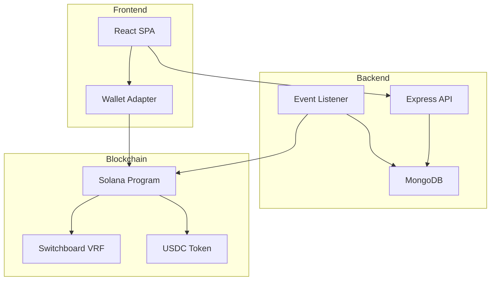

## System Overview

TradMatrix is built on a modern stack combining blockchain, traditional backend, and responsive frontend.



## Technology Stack

### Blockchain Layer

<CardGroup cols={3}>
  <Card title="Solana" icon="link">
    High-performance blockchain
    - 400ms block time
    - Low transaction costs
    - High throughput
  </Card>
  <Card title="Anchor" icon="anchor">
    Solana development framework
    - Type-safe Rust
    - Built-in security
    - Easy testing
  </Card>
  <Card title="Switchboard" icon="shuffle">
    Decentralized oracle network
    - Verifiable randomness
    - Fair winner selection
    - On-chain verification
  </Card>
</CardGroup>

### Backend Layer

<CardGroup cols={3}>
  <Card title="Express.js" icon="server">
    REST API server
    - TypeScript
    - JWT authentication
    - Rate limiting
  </Card>
  <Card title="MongoDB" icon="database">
    NoSQL database
    - Event storage
    - User data
    - Fast queries
  </Card>
  <Card title="Node.js" icon="node-js">
    Event listener service
    - Real-time monitoring
    - Background jobs
    - Notifications
  </Card>
</CardGroup>

### Frontend Layer

<CardGroup cols={3}>
  <Card title="React" icon="react">
    Modern UI framework
    - TypeScript
    - Hooks API
    - Component-based
  </Card>
  <Card title="Vite" icon="bolt">
    Build tool
    - Fast HMR
    - Optimized bundling
    - ES modules
  </Card>
  <Card title="Wallet Adapter" icon="wallet">
    Solana wallet integration
    - Phantom support
    - Auto-connect
    - Transaction signing
  </Card>
</CardGroup>

## Data Flow

### Asset Creation

1. Admin calls `create_asset` on Solana program
2. Program emits `AssetCreated` event
3. Backend event listener catches event
4. Event stored in MongoDB
5. Asset record created in database
6. Frontend polls API and displays new asset

### Ticket Purchase

1. User clicks "Buy Ticket" in frontend
2. Wallet adapter prompts for approval
3. `buy_ticket` transaction sent to Solana
4. USDC transferred to asset vault
5. Ticket PDA created on-chain
6. `TicketPurchased` event emitted
7. Backend processes event
8. Database updated with new ticket
9. Frontend shows updated ticket count

### Winner Selection

1. Admin triggers `pick_winner` when sold out
2. Program requests random value from Switchboard VRF
3. Winning ticket number calculated on-chain
4. Funds automatically distributed:
   - 98.5% to asset owner
   - 1.5% to platform
5. `WinnerSelected` event emitted
6. Backend catches event and updates DB
7. Notification service alerts winner
8. Frontend displays winner announcement

## Smart Contract Architecture

### Program Structure

```
programs/trad-matrix/
├── src/
│   ├── lib.rs                 # Program entry point
│   ├── state/                 # Account structures
│   │   ├── trad_matrix.rs     # Global state
│   │   ├── asset.rs           # Asset accounts
│   │   ├── ticket.rs          # Ticket accounts
│   │   └── user.rs            # User accounts
│   ├── instructions/          # Business logic
│   │   ├── create_trad_matrix.rs
│   │   ├── create_asset.rs
│   │   ├── init_user.rs
│   │   ├── buy_ticket.rs
│   │   └── pick_winner.rs
│   ├── events.rs              # Event emissions
│   └── errors.rs              # Custom errors
```

### Account Types

<Tabs>
  <Tab title="TradMatrix">
    Global state account (singleton)
    ```rust
    pub struct TradMatrix {
        pub admin: Pubkey,           // Platform admin
        pub asset_counter: u64,      // Auto-increment
        pub bump: u8,                // PDA bump
    }
    ```
  </Tab>
  
  <Tab title="Asset">
    Individual asset/lottery
    ```rust
    pub struct Asset {
        pub asset_id: u64,
        pub number_of_tickets: u64,
        pub latest_ticket_id: u64,
        pub ticket_cost: u64,
        pub asset_owner: Pubkey,
        pub platform_authority: Pubkey,
        pub winner: Option<Pubkey>,
        pub status: AssetStatus,
        pub bump: u8,
    }
    ```
  </Tab>
  
  <Tab title="Ticket">
    Individual ticket purchase
    ```rust
    pub struct Ticket {
        pub asset_id: u64,
        pub user: Pubkey,
        pub ticket_cost: u64,
        pub ticket_number: u64,
        pub bump: u8,
    }
    ```
  </Tab>
  
  <Tab title="User">
    User profile
    ```rust
    pub struct User {
        pub username: String,
        pub wallet_address: Pubkey,
        pub bump: u8,
    }
    ```
  </Tab>
</Tabs>

## Security Architecture

### On-Chain Security

<Steps>
  <Step title="Account Validation">
    Verify all PDAs match expected derivation
  </Step>
  <Step title="Ownership Checks">
    Ensure users own accounts they're modifying
  </Step>
  <Step title="Status Validation">
    Check asset status before operations
  </Step>
  <Step title="Overflow Protection">
    Use checked math for all arithmetic
  </Step>
</Steps>

### Backend Security

- **JWT Authentication**: Signed tokens with expiration
- **Wallet Signature Verification**: Prove wallet ownership
- **Rate Limiting**: Prevent abuse
- **Input Validation**: Sanitize all user input
- **CORS Configuration**: Restrict origins
- **Environment Variables**: Secrets not in code

### Frontend Security

- **No Private Keys**: Only public operations
- **Wallet Adapter**: Secure transaction signing
- **HTTPS Only**: Encrypted communication
- **XSS Prevention**: React auto-escaping
- **CSP Headers**: Content security policy

## Scalability Considerations

### Current Limits

- **Solana**: 65,000 TPS theoretical, 2,000-3,000 TPS practical
- **MongoDB**: Millions of documents, sharding available
- **Express**: Horizontal scaling with load balancer
- **Frontend**: Static files on CDN

### Scaling Strategy

As platform grows:

1. **Database**: Implement read replicas, sharding
2. **API**: Add load balancer, auto-scaling
3. **Caching**: Redis for hot data
4. **CDN**: CloudFlare for static assets
5. **Queue**: Bull for background jobs

### Performance Targets

- **Page Load**: < 2 seconds
- **API Response**: < 200ms
- **Transaction Confirm**: < 30 seconds (Solana finality)
- **Event Processing**: < 5 seconds

## Monitoring & Observability

### Metrics Tracked

- Transaction success rate
- API latency (p50, p95, p99)
- Error rates by endpoint
- Active users
- Assets created/sold out
- Revenue metrics

### Tools

- **Datadog**: Application monitoring
- **Sentry**: Error tracking
- **Solana Explorer**: On-chain verification
- **MongoDB Atlas**: Database monitoring

## Deployment

### Environments

<Tabs>
  <Tab title="Development">
    - Solana: Devnet
    - MongoDB: Local
    - API: localhost:3000
    - Frontend: localhost:5173
  </Tab>
  
  <Tab title="Staging">
    - Solana: Devnet
    - MongoDB: Atlas (dev cluster)
    - API: staging-api.tradmatrix.io
    - Frontend: staging.tradmatrix.io
  </Tab>
  
  <Tab title="Production">
    - Solana: Mainnet-beta
    - MongoDB: Atlas (production cluster)
    - API: api.tradmatrix.io
    - Frontend: tradmatrix.io
  </Tab>
</Tabs>

### CI/CD Pipeline

1. Push to GitHub
2. Run tests
3. Build artifacts
4. Deploy to staging
5. Run integration tests
6. Manual approval
7. Deploy to production

## Disaster Recovery

### Backup Strategy

- **Smart Contract**: Immutable on-chain, no backup needed
- **Database**: Daily snapshots, 30-day retention
- **Keys**: Hardware wallet backup, multi-sig
- **Code**: GitHub, multiple mirrors

### Recovery Procedures

In case of:
- **Database failure**: Restore from latest snapshot, replay events
- **API failure**: Swap to backup instance, DNS update
- **Smart contract bug**: Pause operations, deploy fix, migrate state

<Card title="Next: Solana Program Details" icon="code" href="/technical/solana-program">
  Deep dive into the Solana smart contract
</Card>

